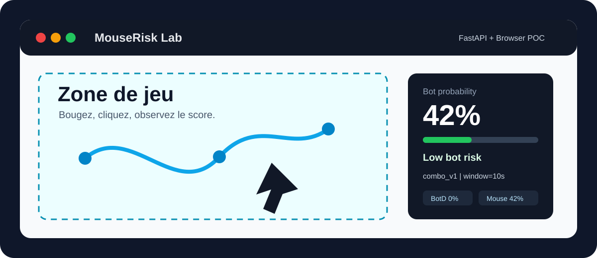
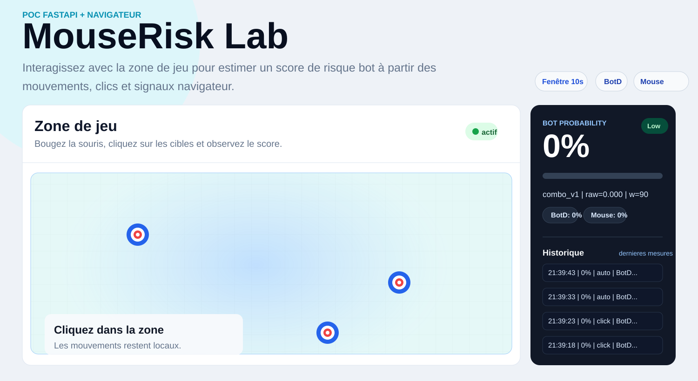
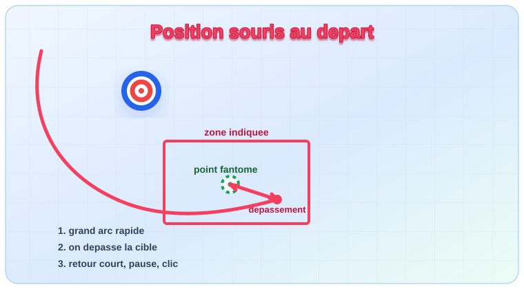

# MouseRisk Lab

<p align="center">
  
</p>

<p align="center">
  
  
  
  
  
</p>

**MouseRisk Lab** est un POC FastAPI + navigateur qui calcule un score de risque bot entre `0` et `1` pendant une interaction de jeu.  
Le score combine des signaux d'automatisation du navigateur avec une heuristique sur la dynamique souris/pointeur.

> Ce projet produit un score probabiliste. Il sert à déclencher de la friction ou du monitoring, pas à bannir automatiquement un utilisateur.

## Aperçu

| Fonction | Détail |
| --- | --- |
| Score temps réel | Recalcul au clic et rafraîchissement automatique en idle |
| Fenêtre glissante | Analyse des mouvements et clics sur les 10 dernières secondes |
| Multi-signaux | BotD, `navigator.webdriver`, plugins, langues, vitesse, trajectoire, régularité |
| Privacy-by-design | Le front envoie des features agrégées, pas la trajectoire brute |
| Sans entraînement | Pas de dataset, pas de pipeline ML, pas de modèle sauvegardé |

<p align="center">
  
</p>

## Interface

<p align="center">
  
</p>

L'interface affiche la zone de jeu à gauche et un panneau de scoring à droite. Le panneau résume la probabilité de bot, les signaux détectés et les dernières mesures.

## Comment ça marche

1. Le navigateur collecte des événements `pointermove`, `pointerdown`, `pointerup` et `click`.
2. Le script frontend calcule des features agrégées : vitesse moyenne, variance, angles, straightness, ratio d'événements trusted.
3. BotD et quelques signaux d'environnement détectent les contextes d'automatisation.
4. L'API FastAPI reçoit le payload sur `POST /api/score`.
5. L'agrégateur combine les détecteurs et renvoie une probabilité de bot.
6. L'overlay met à jour le pourcentage, le statut et l'historique.

## Installation

```bash
python -m venv .venv
```

Windows :

```bash
.venv\Scripts\activate
```

Linux / macOS :

```bash
source .venv/bin/activate
```

Puis :

```bash
pip install -r requirements.txt
```

## Lancer le projet

```bash
python run_server.py
```

Ou directement avec Uvicorn :

```bash
uvicorn app:app --reload --host 127.0.0.1 --port 8000
```

Ouvrez ensuite :

```text
http://127.0.0.1:8000
```

## API

| Méthode | Route | Description |
| --- | --- | --- |
| `GET` | `/` | Page de démonstration |
| `GET` | `/api/health` | Healthcheck |
| `POST` | `/api/score` | Score heuristique à partir des features frontend |
| `GET` | `/api/telemetry?session_id=...&limit=...` | Derniers scores en JSON |

Exemple de réponse :

```json
{
  "bot_probability": 0.72,
  "model": "combo_v1",
  "raw_score": 0.72,
  "signals": {
    "mouse_heuristic_v1": {
      "score": 0.41,
      "raw": {}
    },
    "botd_v2": {
      "score": 0.72,
      "raw": {}
    }
  }
}
```

## Test humain automatisé

Installez les dépendances du script :

```bash
pip install -r requirements-test.txt
```

Lancez le script après avoir ouvert la page dans le navigateur :

```bash
python tools/human_mouse_test.py --region 100,200,900,800 --n-clicks 5
```

`REGION` correspond à la zone cliquable du jeu, au format écran `x1,y1,x2,y2`.  
Pour calibrer proprement, utilisez un outil de coordonnées souris et ciblez uniquement la zone de jeu.

## Environnement de test réel

Un lab plus complet est disponible pour comparer plusieurs comportements de souris à l'écran :

```bash
python tools/real_mouse_lab.py --region 100,390,1100,760 --mode human --count 12
python tools/real_mouse_lab.py --region 100,390,1100,760 --mode teleport --count 12
python tools/real_mouse_lab.py --region 100,390,1100,760 --mode grid --count 12
```

Les modes disponibles sont `human`, `linear`, `teleport`, `grid`, `center` et `double`.

Voir [docs/real-test-environment.md](docs/real-test-environment.md) pour la calibration de la zone et l'interprétation des scores.

## Lanceur depuis le site

Le site peut maintenant lancer des programmes Python placés dans le dossier `mouse_programs/`.

Chaque fichier doit accepter ces arguments CLI :

```bash
--base-url http://127.0.0.1:8000 --region x1,y1,x2,y2 --count 20 --focus-wait 3
```

Pour créer un nouveau cliqueur réutilisable, exposez aussi ces 3 fonctions globales :

```python
def moveTo(point, *, region=None, **options):
    """Déplace la souris vers un point, sans cliquer."""

def click_point(point, *, button="left", region=None, **options):
    """Clique un point précis."""

def click_zone(*, region, button="left", **options):
    """Choisit un point dans la zone, puis appelle click_point(...)."""
```

Exemples fournis :

| Fichier | Comportement |
| --- | --- |
| `linear_sweep_clicks.py` | Balayage linéaire simple et régulier |
| `pyautogui_moveto_down_up.py` | Déplacement PyAutoGUI `moveTo`, puis clic gauche `mouseDown` / `mouseUp` |
| `adaptive_spiral_human.py` | Trajectoires courbes, spirales de stabilisation et timings irréguliers |
| `adaptive_spiral_human_plus.py` | Box verte aleatoire dans la zone rouge, clic down/up a l'entree |
| `personal_arc_click.py` | Grand arc rapide, depassement de la cible, retour par arc, puis clic precis |
| `human_random.py` | Déplacements aléatoires humanisés |
| `teleport_grid.py` | Clics très rapides sur une grille |
| `rapid_center.py` | Double-clics rapides au centre |
| `obvious_bot_api.py` | Envoi de signaux synthétiques clairement automatisés vers l'API |

Depuis l'interface, sélectionnez le fichier, estimez ou saisissez la région écran, puis lancez le programme.

### Réutiliser `adaptive_spiral_human_plus.py`

La partie réutilisable du profil expose deux fonctions publiques :

```python
from mouse_programs.adaptive_spiral_human_plus import click_point, click_zone

click_point((500, 400), button="left")

result = click_zone(
    region=(100, 390, 1100, 760),
    button="right",
    click_box_scale=0.35,
)
```

`click_point` vise un point précis. `click_zone` reçoit une zone rouge, génère une zone verte aléatoire dedans, puis déclenche `mouseDown` / `mouseUp` à l'entrée dans la zone verte.

### Réutiliser `personal_arc_click.py`

Cette variante reproduit un geste en deux temps : depart depuis la position souris actuelle, grand arc rapide qui depasse la cible, retour par un deuxieme arc vers le point exact, petite pause, puis clic.
Les courbes par defaut sont reglees environ 1.5x plus marquees que la premiere version, sans aller au-dela pour garder un geste naturel.

<p align="center">
  
</p>

```python
from mouse_programs.personal_arc_click import click_point, click_zone, moveTo

moveTo((450, 350))
click_point((500, 400), button="left")

result = click_zone(
    region=(100, 390, 1100, 760),
    button="right",
)
```

`moveTo` deplace sans cliquer. `click_point` clique un point precis. `click_zone` choisit un point dans la zone donnee, puis appelle `click_point`.

## Détecteur externe ML optionnel

MouseRisk Lab peut interroger un modèle externe déjà entraîné exposé par une API FastAPI compatible avec `kim-daehyun/bot-serving`.

Lancez `bot-serving` sur le port `8001`, avec une route disponible sur :

```text
http://127.0.0.1:8001/predict/fe
```

Le détecteur `external_fe_bot_v1` envoie les features agrégées `duration_ms`, `mousemove_count` et `mousemove_teleport_count` à cette route. Il est optionnel : si l'API externe est indisponible, MouseRisk Lab continue de fonctionner et le signal externe retourne un score `0.0` avec un statut d'erreur.

Vous pouvez remplacer l'URL cible avec la variable d'environnement :

```bash
EXTERNAL_FE_BOT_URL=http://127.0.0.1:8001/predict/fe
```

Le dépôt `bot-serving` peut être placé dans `external/bot-serving`. Dans ce cas, `run_server.py` le lance automatiquement en parallèle sur le port `8001` avec son environnement virtuel local si `external/bot-serving/.venv` existe.

Vous pouvez aussi fournir une commande personnalisée :

```powershell
$env:EXTERNAL_FE_BOT_CWD="C:\chemin\vers\bot-serving"
$env:EXTERNAL_FE_BOT_CMD="uvicorn app:app --host 127.0.0.1 --port 8001"
python run_server.py
```

Si l'application FastAPI de `bot-serving` est exposée par `main.py`, utilisez plutôt :

```powershell
$env:EXTERNAL_FE_BOT_CMD="uvicorn main:app --host 127.0.0.1 --port 8001"
```

## Tests automatisés

Installez les dépendances de test :

```bash
pip install -r requirements-test.txt
```

Lancez la suite `pytest` :

```bash
python -m pytest -q
```

Les tests couvrent l'API FastAPI, l'agrégateur, BotD et l'heuristique souris.

## Structure

```text
.
├── app.py                     # API FastAPI et endpoints
├── run_server.py              # Lancement local
├── detectors/
│   ├── aggregator.py          # Combinaison des détecteurs
│   ├── botd_v2.py             # Signal BotD / automation
│   └── heuristic_mouse_v1.py  # Heuristiques souris
├── static/
│   ├── index.html             # Démo navigateur
│   ├── style.css              # Présentation de la page
│   └── bot_risk.js            # Collecte et scoring frontend
├── docs/
│   └── real-test-environment.md
├── mouse_programs/
│   ├── linear_sweep_clicks.py
│   ├── pyautogui_moveto_down_up.py
│   ├── adaptive_spiral_human.py
│   ├── adaptive_spiral_human_plus.py
│   ├── personal_arc_click.py
│   ├── rapid_center.py
│   ├── teleport_grid.py
│   ├── obvious_bot_api.py
│   └── human_random.py
└── tools/
    ├── human_mouse_test.py    # Script de test simple avec pyclick
    └── real_mouse_lab.py      # Lab de mouvements souris réels
```
